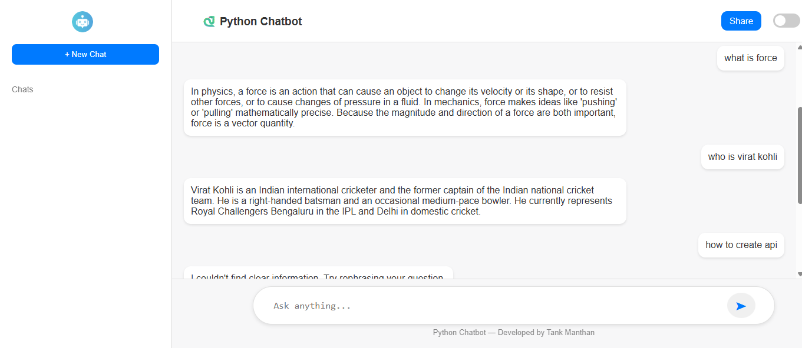
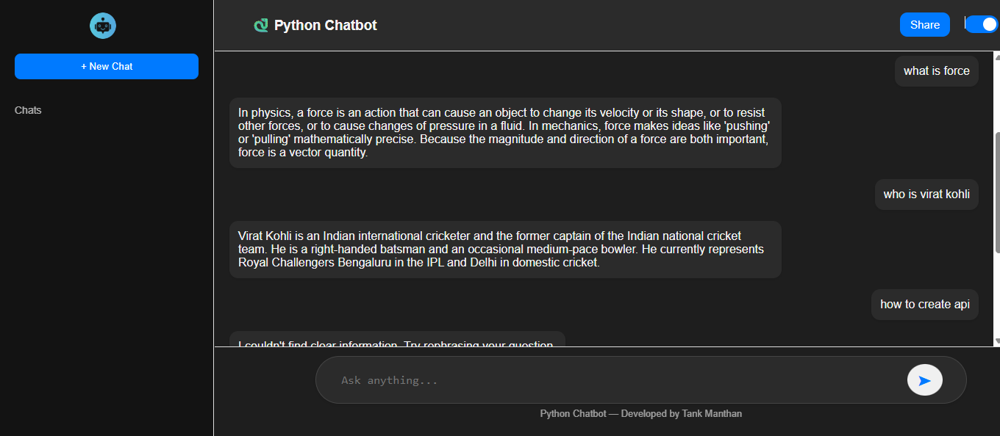

  

A modern, ChatGPT-styled chatbot powered by Python + Flask with live search (Wikipedia + DuckDuckGo) and smart summarization.

  
  
  
  

---

## 📸 Preview

  

### 🌙 Dark Mode

  

---

## ✨ Features

- 💬 **ChatGPT-style UI/UX**
- 🔍 **Live search from Wikipedia + DuckDuckGo**
- 🧠 **Smart 3–4 line summarizer**
- ⚡ **Typing animation like ChatGPT**
- 🌙 **Dark / Light mode toggle**
- 📱 **Fully mobile responsive**
- 📤 **Chat export (TXT)**
- ✏️ **Auto-expanding input box**
- 🚫 **No API key required**
- 🆓 **Completely free & open-source**

---

## 🛠 Installation

### 1️⃣ Clone the repository
git clone https://github.com/yourusername/python-chatbot.git
cd python-chatbot

###2️⃣ Install dependencies
pip install -r requirements.txt

###3️⃣ Run the server
python app.py

###4️⃣ Open in browser
http://127.0.0.1:5000

---

## 🔍 How It Works
1. User enters a query
2. Backend fetches:
  Wikipedia summary
  DuckDuckGo instant answers
3. Results are cleaned & merged
4. Summarizer returns a 3–4 line final answer
5. UI shows animated typing bubble, then displays the response

---

🧩 Technologies Used
Python
Flask
Requests (API calls)
HTML / CSS / JavaScript
Wikipedia API
DuckDuckGo API
